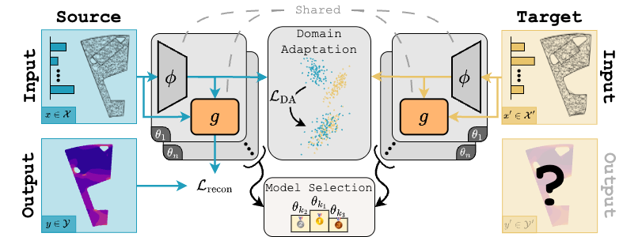

# SIMSHIFT: A Benchmark for Adapting Neural Surrogates to Distribution Shifts

<div align="center">

[](https://arxiv.org/pdf/TODO)
[](https://simshift.readthedocs.io/en/latest/index.html)
[](LICENSE)

[](https://www.python.org/downloads/release/python-3110/)
[](https://pytorch.org/docs/2.6/)
[](https://hydra.cc/)



</div>

> Paper: https://arxiv.org/abs/2506.12007
>
> Authors: Paul Setinek, Gianluca Galletti, Thomas Gross, Dominik Schnürer, Johannes Brandstetter, Werner Zellinger

## Overview

This repository contains the datasets, dataloaders, baseline models, unsupervised domain adatpation algorithms and model selection strategies together with experiments and evaluation protocols for **SIMSHIFT**, a benchmark designed to evaluate Unsupervised Domain Adaptation (UDA) methods for neural surrogates of physical simulations. The benchmark's datasets target real world industrial scenarios and provides distribution shifts across parameter configurations in mesh-based PDE simulations.

**Datasets:**

- **Hot rolling**
- **Sheet metal forming**
- **Electric motor design**
- **Heatsink desing**

All the datasets are hosted on Huggingface at [https://huggingface.co/datasets/simshift/SIMSHIFT_data](https://huggingface.co/datasets/simshift/SIMSHIFT_data).

### 1. Installation

Clone the repo:

```bash
git clone https://github.com/psetinek/simshift.git
cd simshift
```

Create a new virual environment (the code was developed and tested with python 3.11):

```bash
conda create -n simshift python=3.11
conda activate simshift
```

First please install you desired torch version (the repo was tested with torch 2.6.0), as shown [here](https://pytorch.org/get-started/locally/). If you are on a linux system and have cuda 12.6, the command would be:

```bash
pip install torch==2.6.0 --index-url https://download.pytorch.org/whl/cu126
```

Additionally, we use [PyTorch Geometric (PyG)](https://pytorch-geometric.readthedocs.io/), please install it as follows:

```bash
pip install torch_geometric
```

We also need `torch-scatter`. To install it, first check your PyTorch and CUDA version:

```bash
python -c "import torch; print(f'PyTorch {torch.__version__}, CUDA {torch.version.cuda}')"
```

Then install the packages above as described in the respective [documentations](https://pypi.org/project/torch-scatter/). For torch 2.6.0 and CUDA 12.6, it would work like:

```bash
pip install torch-scatter -f https://data.pyg.org/whl/torch-2.6.0+cu126.html
```

Finally, install the `simshift` package, via:

```
pip install -e .
```

#### 2. Tutorial notebooks

To get familiar with the capabilities of this repository, we provide a [`tutorial notebook`](./notebooks/tutorial.ipynb) showing easy model training and result evaluation and visualization. [](https://colab.research.google.com/github/psetinek/simshift/blob/main/notebooks/tutorial.ipynb)

Please also take a look at the [documentation](https://simshift.readthedocs.io/en/latest/) of the package.

#### 3. Paper results reproduciblility

In order to provide maximum transparency, we provide clear instructions on how we obtained the papers results [here](./results/README.md).
